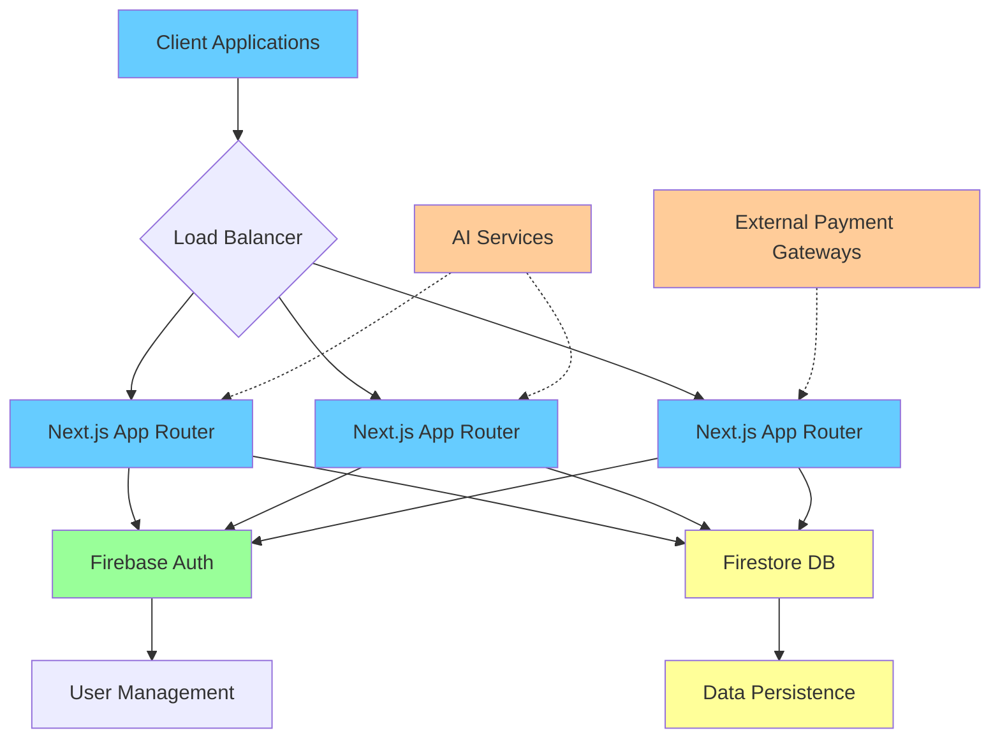
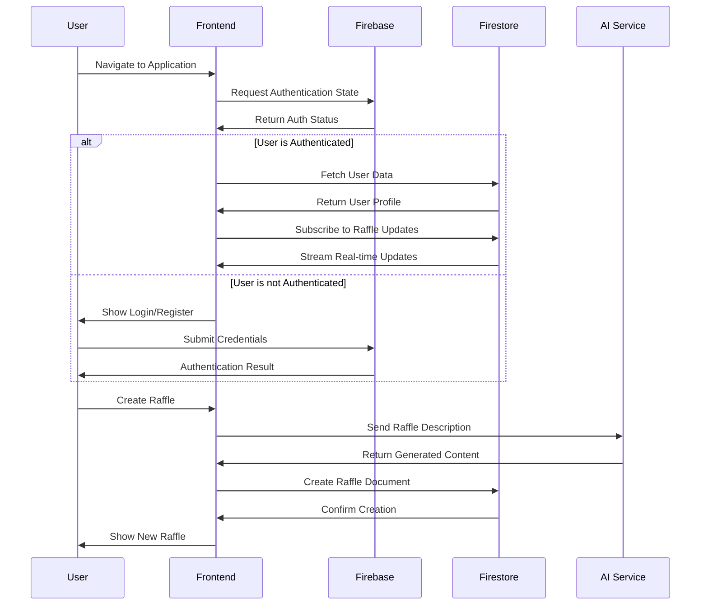
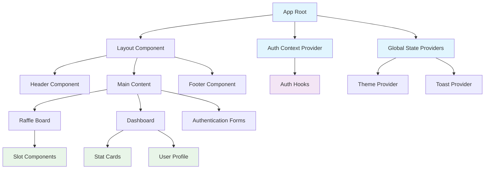
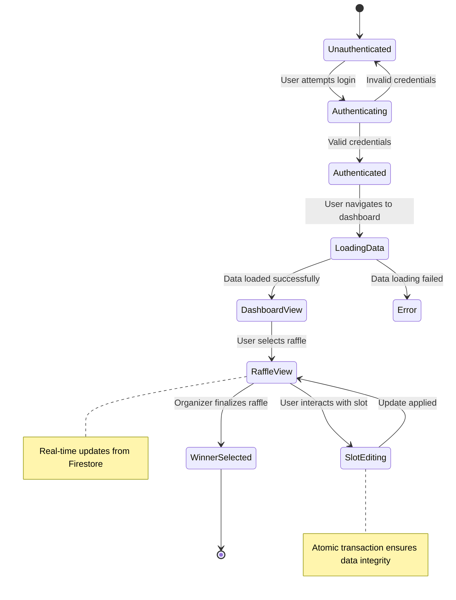

# Lucky 100 Raffle

A modern, full-stack web application designed for creating and managing 100-slot raffles with real-time updates, secure authentication, and intelligent content generation. Built with cutting-edge technologies to provide a seamless experience for both organizers and participants.

## 🌟 Features

### Core Functionality
- **Real-time Raffle Management**: Create, manage, and finalize raffles with 100 interactive slots
- **Multi-user Authentication**: Secure registration, login, and session management
- **Live Updates**: Real-time synchronization of raffle status across all connected users
- **Intelligent Content Generation**: AI-powered raffle creation with automatic naming and description
- **Secure Winner Selection**: Atomic transactions ensuring fair winner selection
- **Responsive Design**: Fully responsive interface optimized for all device sizes

### Advanced Features
- **Visual Status Tracking**: Color-coded slot states for intuitive status recognition
- **Dashboard Analytics**: Comprehensive metrics and insights for raffle organizers
- **Secure Payment States**: Multiple payment statuses with visual indicators
- **Public Raffle Access**: Shareable raffle pages with real-time updates
- **Admin Controls**: Comprehensive moderation and management tools

## 🛠️ Technology Stack

### Frontend
- **Framework**: Next.js 14 with App Router
- **Language**: TypeScript for type safety
- **Styling**: Tailwind CSS with a custom warm color palette
- **UI Components**: Radix UI primitives with custom theming
- **Animations**: Framer Motion for smooth microinteractions

### Backend & Infrastructure
- **Authentication**: Firebase Authentication
- **Database**: Firestore NoSQL database with real-time listeners
- **Hosting**: Cloud-based deployment with CDN
- **Real-time Features**: Firestore real-time subscriptions

### Development & Tools
- **State Management**: React Context API and custom hooks
- **Form Handling**: React Hook Form with Zod validation
- **UI Logic**: Radix UI for accessible components
- **Build Tool**: Next.js compiler with TypeScript transpilation

## 🏗️ Architecture Overview

### System Architecture


### Data Flow Architecture


### Component Architecture


### State Management Flow


## 📊 Key Functionalities

### Raffle Management System
- **Creation Process**: Organizers can create new raffles with customizable parameters
- **Slot Management**: Interactive grid system with color-coded status indicators
- **Real-time Updates**: All participants see changes instantly through Firestore listeners
- **Finalization Process**: Atomic transactions ensure winner selection integrity

### Authentication & Authorization
- **Multi-tier Access Control**: Different permissions for organizers, participants, and guests
- **Session Management**: Secure token handling with automatic refresh
- **Role-based Features**: Functionality varies based on user type and permissions

### Visual Design System
- **Warm Color Palette**: Custom earthy tone implementation for enhanced user experience
- **Responsive Layouts**: Mobile-first design approach with adaptive components
- **Accessibility Focus**: WCAG compliant components and navigation patterns
- **Microinteractions**: Smooth animations and visual feedback for user actions

## 🧪 Development Workflow

### Project Structure
```
src/
├── app/                    # Next.js App Router pages
│   ├── (app)/             # Main application routes
│   ├── (auth)/            # Authentication flows
│   └── api/               # API routes
├── components/            # Reusable React components
│   ├── ui/                # Base UI components
│   ├── layout/            # Layout components  
│   ├── dashboard/         # Dashboard-specific components
│   └── raffle/            # Raffle management components
├── lib/                   # Business logic and utilities
│   ├── firebase.ts        # Firebase configuration
│   ├── firestore.ts       # Database operations
│   └── utils.ts           # General utilities
├── context/               # React Context providers
└── types/                 # TypeScript type definitions
```

## 📈 Performance & Scalability

### Optimization Features
- **Code Splitting**: Automatic route-based code splitting
- **Image Optimization**: Next.js Image component with lazy loading
- **Bundle Analysis**: Webpack bundle analyzer integration
- **Caching Strategy**: Intelligent caching patterns for data and assets

### Scalability Considerations
- **Firestore Indexing**: Optimized queries with proper indexing
- **Real-time Subscriptions**: Efficient listener management
- **CDN Integration**: Global content delivery optimization
- **Serverless Functions**: Scalable backend operations

## 🛡️ Security

### Authentication Security
- **Secure Token Storage**: Proper handling of authentication tokens
- **Session Validation**: Regular session status verification
- **Rate Limiting**: Protection against abuse patterns

### Data Security
- **Firestore Security Rules**: Granular access control
- **Input Validation**: Comprehensive client and server validation
- **Data Encryption**: End-to-end encryption for sensitive information
